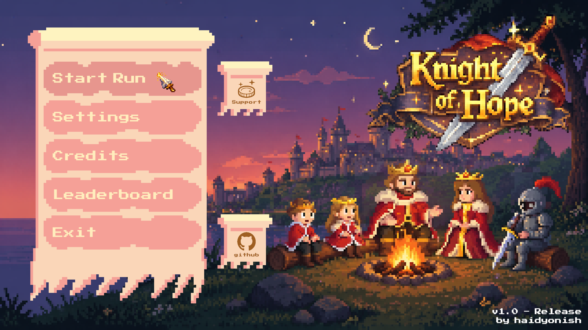
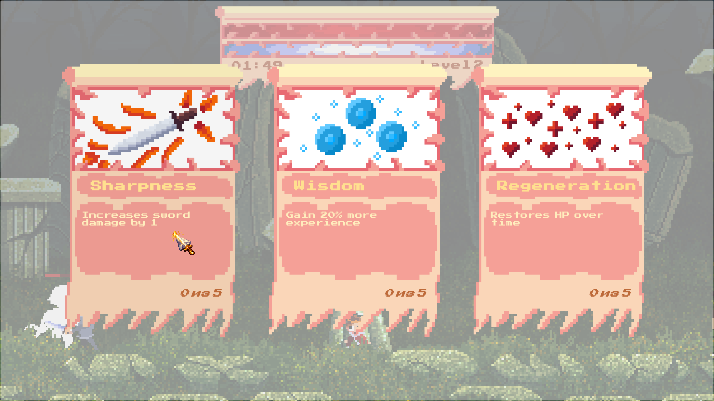
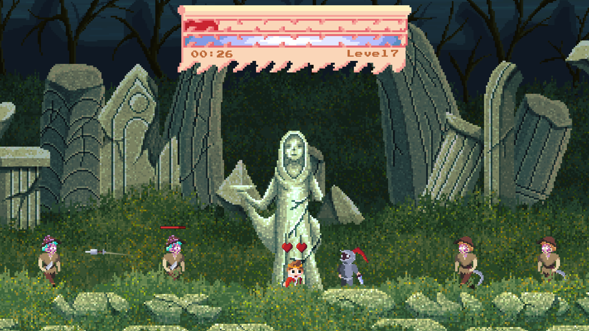
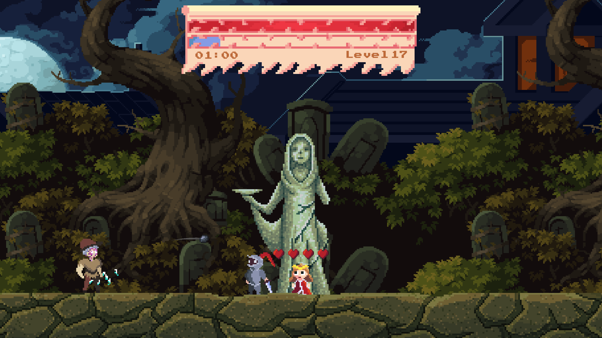
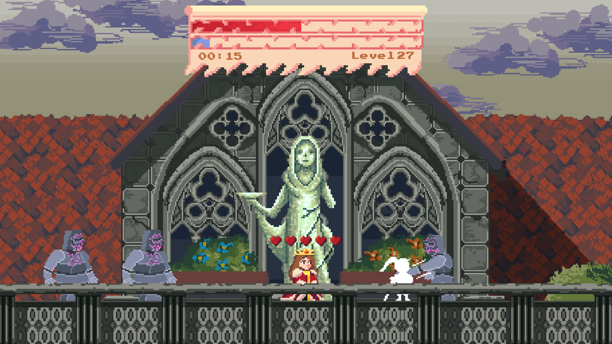
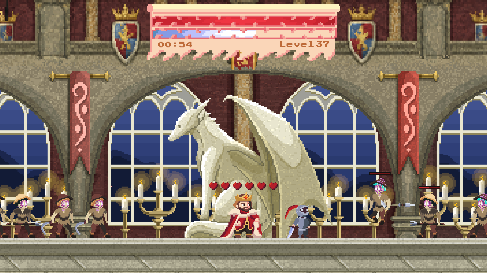
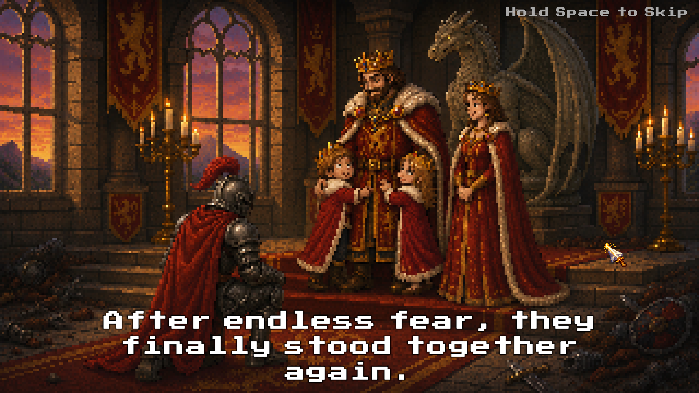
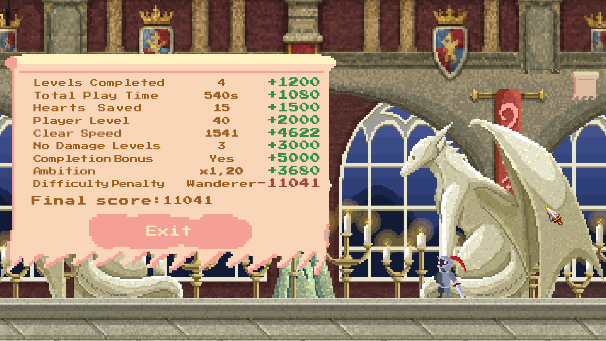
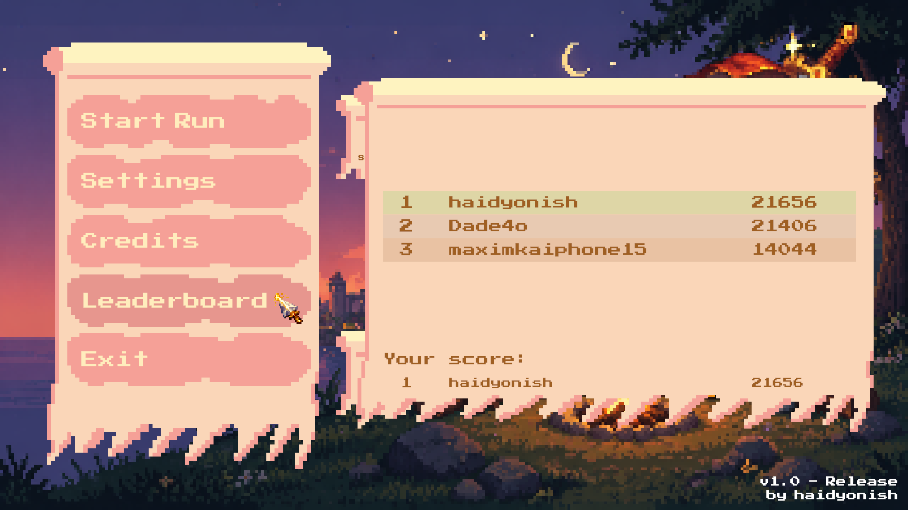

# Knight of Hope

Pixel-art roguelite about defending the royal family against waves of enemies.

---

## Features

- 4 unique levels
- upgrade system
- cinematic slide transitions
- online leaderboard
- English / Russian localization
- pixel-art visual style

---

## Controls

| Action | Key |
|---|---|
| Move | A / D |
| Jump | Space |
| Attack | Left Mouse Button |
| Pause | Escape |

---

## Screenshots

### Upgrade Selection

### Level 1

### Level 2

### Level 3

### Level 4

### Cinematic Slide

### Statistics Screen

### Leaderboard

---

## Download

Play the game on Itch.io:

https://haidyonish.itch.io/

---

## Tech Stack

- Unity 6
- C#
- TextMeshPro
- LEADR SDK
- Aseprite
- Audacity

---

## Credits

See [CREDITS.md](CREDITS.md)

---

## Developer

Developed by Danila Chichkin (haidyonish)

GitHub:
https://github.com/haidyonish

Itch.io:
https://haidyonish.itch.io/

Boosty:
https://boosty.to/haidyonish